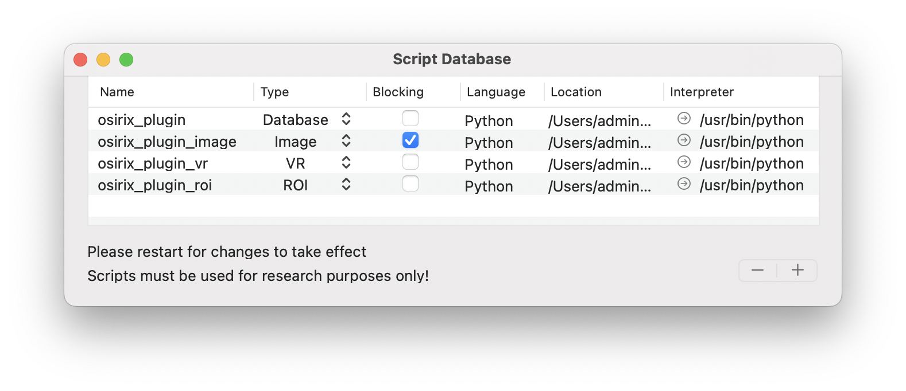

# Getting Started

The following steps demonstrate how to install the plugin and subsequently start up a local OsiriX server and run 
scripts that can be defined in any source file on your system. To see how to write GRPC client code for use with 
OsiriXgrpc please see the [API](docs/docfiles/api/README.md).  

The OsiriXgrpc plugin consists of three core functionalities, all of which are accessible from the OsiriX submenus at
`Plugins` &rarr; `Database` &rarr; `osirixgrpc`:

1. __Server Configuration__ allows you to start and stop OsiriXgrpc servers. At lease one server must be active in 
   clients to be able to communicate with OsiriX.
2. __Script Management__ provides the list of client files currently registered by OsiriXgrpc that can be run through 
   the OsiriXgrpc menu bars. This includes the locations of the scripts and executable used to run them. 
3. __Task Console__ shows the currently running scripts and provides a location for all stdout and stderr messages to
   recorded.

## Installation
1. Download the [latest release](404.html).
2. Extract the downloaded archive.
3. Drag the `osirixgrpc.osirixplugin` file to the OsiriX application you want to install to.
4. Follow instructions for further installation.

## Server Configuration

OsiriXgrpc servers can be started and paused using the server configuration window.

To start one of the available servers, press the &#9654; button and the `Active` status will turn green once this has 
been successful (&#9679;). Alternatively, to stop a running server press
&#9632; and the `Active` status will turn red (&#9679;). If, for any reason,
the server cannot be started or shutdown, an error message should appear at the bottom of the window.

By pressing the "+" it is possible to add a new server, or remove one by "-". Any unique port number can be chosen, and 
checks will be made prior to starting the server that the port is available.

> ___Note___: For security reasons, all OsiriXgrpc servers are local (IP address 127.0.0.1). Only clients run on the same
machine as the OsiriX app have access to the API. If communication is required with another machine on a network (a GPU 
node for example), this can be achieved by the client as necessary.

> ___Note___: All servers are run on a separate thread to the main OsiriX thread.

> ___Note___: The list of available server port numbers are available to outside applications as a JSON file located in
  the directory `/Users/username/Library/Application Support/OsiriXGRPC/server_configs.json`.  For each server the IP
  address (always 127.0.0.1), port, and active status are available.  The order of preference matches that in server 
  configuration window.

## Script Management 

Although not necessary, scripts can be registered with OsiriXgrpc so that users can run them without needing to see any 
code whatsoever. To register a script, select the `Script Management` plugin sub-menu to start the script database 
console.

 - `Name`: The name of the script, which is automatically taken as the filename (without file extension).
 - `Type`: A drop-down that determines which drop-down menu contains the button to start the script.
     - `Database`: Scripts that generally deal with user-selection in the OsiriX Dicom database (main screen).
     - `Image`: Scripts that generally perform some image manipulation (e.g. filtering or segmentation)
     - `VRController`: Scripts that generally operate on the 3D viewer.
     - `ROI`: Scripts that generally manipulate drawn regions of interest.
 - `Blocking`: Scripts that are blocking, block the OsiriX runtime until the script has finished running. This is
    generally undesired, but might be necessary to avoid conflicts of user operation.
 - `Language`: Automatically detects which language is used. Currently, we only support Python.
 - `Location`: The complete path to the script file. This cannot be edited - please remove the script if no longer 
    accurate.
 - `Interpreter`: The complete path to the binary file used to run the script. We strongly suggest that for Python 
    scripts this should be an interpreter managed by an environment manager such as [conda](https://conda.io/). This 
    will make package management easy!

To add or remove a script, press the "+" or "-" keys. When adding a script, the console will ask for the location of 
the script file.  The location of the interpreter should be manually set afterwards.

### Drop-down menus
All registered scripts can be started from dedicated menus.  These menus are not visible by default.  To add them to 
either (i) the Database viewer, (ii) the image viewer, or (iii) the volume-render viewer, please right-click the top 
ribbon toolbar in each of these windows, select `Customize Toolbar...`, and drag-and-drop the OsiriXgrpc menu item
(`gRPC Tasks`) into a free slot on the toolbar.

> ___Note___: Please restart OsiriX for all changes to take effect.

## Task Console
The task console provides all stdout and stderr messages for the registered scripts run through the script management 
interface. Outputs can be saved and the console can be cleared.

## OsiriXgrpc Basics
The figure below presents the core OsiriXgrpc components, their core functionality, and how they interact with one 
another. Note that this is meant to be an overview only.  Precise implementation details will depend on the API you use
to interact with OsiriX through OsiriXgrpc, for example through the [OsiriXgrpc API](api/README.md) or via the 
[pyOsiriX submodule](pyosirix/README.md). 

### BrowserController
Represents the core Dicom database of OsiriX. It contains references to all the Dicom instances that have been 
imported as three nested objects: [DicomStudy](#dicomstudy), [DicomSeries](#dicomseries), and [DicomImage](#dicomimage).
Access to the Browser can be achieved in OsiriXgrpc using the [`OsirixCurrentBrowser` message](api/README.md).
See the [BrowserController API](api/dicomstudy.md) for more details.

### DicomStudy
Represents a complete Dicom study, encompassing both instances of [DicomSeries](#dicomseries) and 
[DicomImage](#dicomimage). Also contains relevant metadata for the enclosed Dicom instance (patient name, study date,
modalities etc.). See the [DicomStudy API](api/dicomstudy.md) for more details.

### DicomSeries
Represents a Dicom series, encompassing instances [DicomImage](#dicomimage). Also contains relevant metadata for the 
enclosed Dicom instance (series description, modality etc.). See the [DicomSeries API](api/dicomseries.md) for more 
details.

### DicomImage
Represents a Dicom image (frame). Contains the complete path of the stored Dicom file on the host machine, accessible 
via the [`DicomImageCompletePath`](api/dicomimage.md) message. Also contains relevant metadata for the 
image (width, height, SOPInstanceUID). See the [DicomSeries API](api/dicomseries.md) for more details.

### ViewerController
An open 2D image viewer, with all associated viewing details such as windowing setting, color-lookup table, displayed 
slice etc. Use this to change how images are displayed within OsiriX to the user. Contained data are always displayed 
in 4D, with only a single frame if no movie data are displayed. 
Access to the currently active viewer (framed by a red box) can be achieved in OsiriXgrpc using the 
[`OsirixFrontmostViewer` message](api/README.md), or access to all viewers via the 
[`OsirixDisplayed2DViewers` message](api/README.md). See the [ViewerController API](api/viewercontroller.md) for 
more details.

### DCMPix
An object representing raw image data, including the location of the original Dicom file. Can be either greyscale 
(floating points values) or ARGB format (each channel is unsigned short with range 0-255). There are utility messages 
that allow you convert between the two. See the [DCMPix API](api/dcmpix.md) for more details.

### ROI
Regions of interest drawn by the user. In general there are two kinds: polygonal and mask. However, polygonal ROIs
come in different forms depending on how the user has drawn them (e.g. closed, open, line measurement). For more 
information on this, it is best to check the [pyOsiriX documentation](pyosirix/api/roi.md). However, in general,
polygonal ROIs are represented as an ordered list of 2-element tuples, each representing a column/row for a vertex 
(non-integer). Mask ROIs are represented by a 2D array of boolean values. Other ROI attributes such as color, name,
thickness, opacity etc. can be modified. Creation of new ROIs must be dones through the appropriate 
[ViewerController](#viewercontroller) object.  See the [ROI API](api/roi.md) for other details.

### VRController
Represents the viewer displaying 3D data. These are always associated with some underlying 2D data via a 
[ViewerController](#viewercontroller) object. Access to the currently active controller can be achieved in OsiriXgrpc 
using the [`OsirixFrontmostVRController` message](api/README.md), or access to all viewers via the 
[`OsirixDisplayedVRControllers` message](api/README.md).
Provides access and allows control of display attributes including windowing settings and whether the volume render is 
in Maximum Intensity Project (MIP) or Volume Render (VR) mode. Also provides access to instances of 
(ROIVolume)[#roivolume]. See the [VRController API](api/vrcontroller.md) for more details.

### ROIVolume
__Note__: ROIs in OsiriX are grouped by name!
Represents a volume of ROIs, all of which have the same name. Volumes can on;y be generated where there is a single ROI 
of the same name on each imaging slice. Provides some immutable attributes such as ROI volume, and some mutable ones 
such as color, opacity and texture. See the [ROIVolume API](api/roivolume.md) for more details.

## Next Steps
__Congratulations!__ You should now be ready to create client scripts to interact with OsiriX.
For next steps see [Basics of OsiriXgrpc](api/README.md), __or even better__ we suggest the 
[pyOsiriX documentation](pyosirix/README.md).
