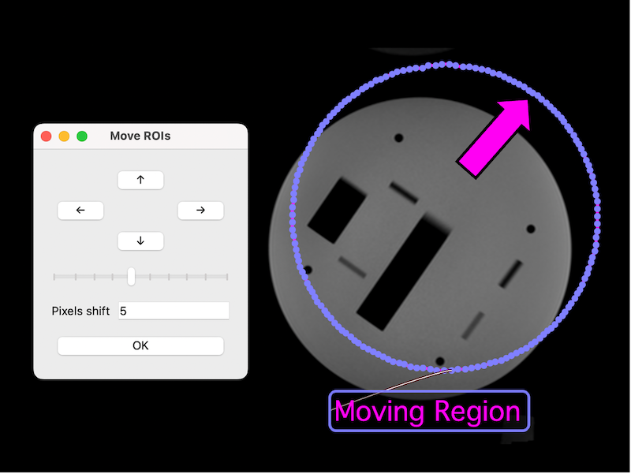

<!-- Choose a short, distinct and distinctive name for your script.  Should match name of parent directory -->
# ROI Nudge

<!-- 
A short description of what the example script tries to achieve (single sentence/line).
Please ensure that the leading comment is left in! 
-->
<!-- shortdesc --> A tool for nudging ROIs in-plane by specified rows/columns

<!-- Choose the relevant categories out of "Database-blue", "Image-green", "ROI-purple" or "VR-red" -->
__Categories__:

<!-- Do not modify. Source image must have size 800 x 600 pixels. -->

<!-- 
Please ensure that you (and your institution) get acknowledgment for your contribution!
Multiple entries should be comma-separated.
-->
## Authors
<table>
  <tr>
    <td> <b>Author(s)</b> </td>
    <td> Matthew Blackledge1 </td>
  </tr>
  <tr>
    <td> <b>Institution(s)</b> </td>
    <td> 1The Institute of Cancer Research </td>
  </tr>
  <tr>
    <td> <b>Contact</b> </td>
    <td> matthew.blackledge@icr.ac.uk </td>
  </tr>
</table>

<!-- Provide the data provenance (i.e. where it may be downloaded from). Use "Any data" if it works on any dataset. -->
## Datasets
Any data.

<!-- 
Here you can provide any additional details about the script to the user (e.g. use case or expected outcomes)
There is no limit on what information you wish to provide and subsection headings are flexible. 
-->
## Details
This script also shows how to integrate additional an additional (modal) user-interface through PyQt5.
To use it:

  - Select some ROIs in a viewer.
  - Select the number of rows/columns to shift by.
  - Hold down the direction keys to move the selected ROIs in that particular direction.
  - When done, click "OK".

### Expected Outcome
The script should open up a modal dialogue that allows the user to interact with selected ROIs. 