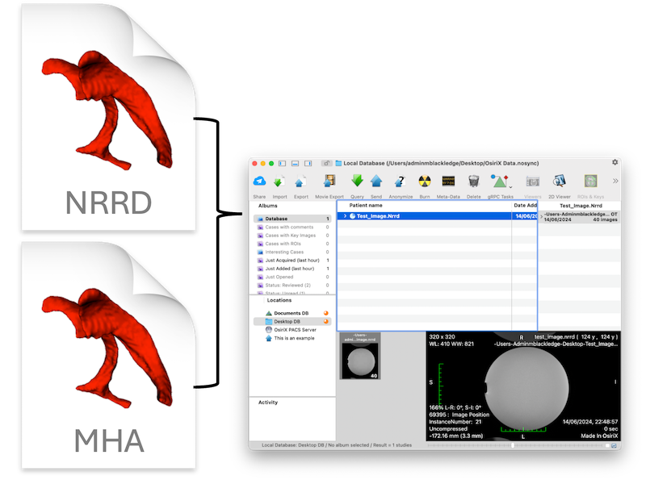

<!-- Choose a short, distinct and distinctive name for your script.  Should match name of parent directory -->
# Template

<!-- shortdesc --> A script for importing and visualizing ITK images (e.g. nrrd, mhd/mha, nifti) within OsiriX. 

<!-- Choose the relevant categories out of "Database-blue", "Image-green", "ROI-purple" or "VR-red" -->
__Categories__:

<!-- Do not modify. Source image must have size 800 x 600 pixels. -->

<!-- 
Please ensure that you (and your institution) get acknowledgment for your contribution!
Multiple entries should be comma-separated.
-->
## Authors
<table>
  <tr>
    <td> <b>Author(s)</b> </td>
    <td> Matthew Blackledge1 </td>
  </tr>
  <tr>
    <td> <b>Institution(s)</b> </td>
    <td> 1The Institute of Cancer Research </td>
  </tr>
  <tr>
    <td> <b>Contact</b> </td>
    <td> matthew.blackledge@icr.ac.uk </td>
  </tr>
</table>

## Datasets
Any data.

## Details
This script will read an ITK image format, create basic Dicom files, and load them into OsiriX for viewing. 
Note that all created Dicom files will have SOP class "Secondary Capture Image" by default. Please change the relevant
line in the code `ds.SOPClassUID = "1.2.840.10008.5.1.4.1.1.7"` to the necessary image type if required.
Each ITK image will have a unique series and study UID.

### Expected Outcome
Should load the ITK image into the OsiriX database for visualization.