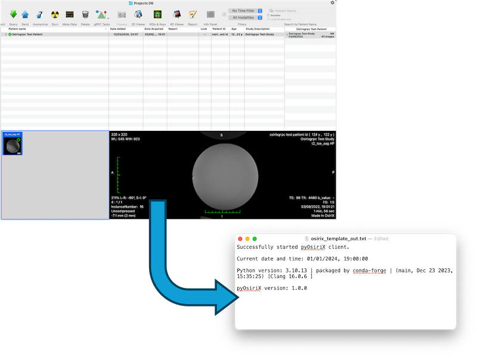

<!-- Choose a short, distinct and distinctive name for your script.  Should match name of parent directory -->
# Template

<!-- 
A short description of what the example script tries to achieve (single sentence/line).
Please ensure that the leading comment is left in! 
-->
<!-- shortdesc --> A template example script that may be used to format other scripts.

<!-- Choose the relevant categories out of "Database-blue", "Image-green", "ROI-purple" or "VR-red" -->
__Categories__:

<!-- Do not modify. Source image must have size 800 x 600 pixels. -->

<!-- 
Please ensure that you (and your institution) get acknowledgment for your contribution!
Multiple entries should be comma-separated.
-->
## Authors
<table>
  <tr>
    <td> <b>Author(s)</b> </td>
    <td> Joe Bloggs1 </td>
  </tr>
  <tr>
    <td> <b>Institution(s)</b> </td>
    <td> 1The Institute of Research </td>
  </tr>
  <tr>
    <td> <b>Contact</b> </td>
    <td> joe.bloggs@institute.com </td>
  </tr>
</table>

<!-- Provide the data provenance (i.e. where it may be downloaded from). Use "Any data" if it works on any dataset. -->
## Datasets
Any data.

<!-- 
Here you can provide any additional details about the script to the user (e.g. use case or expected outcomes)
There is no limit on what information you wish to provide and subsection headings are flexible. 
-->
## Details
This example script is used to demonstrate how to write pyOsiriX examples. It can be run as any of the four categories.

### Expected Outcome
This should export the current date, time and python version to a file on the Desktop called `osirix_template_out.txt`.
